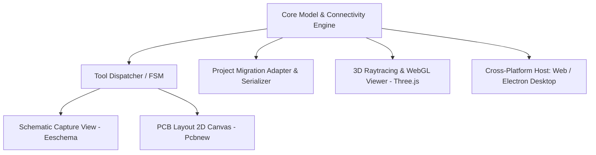

# FloZ ECA — Release Certification Plan

**Project**: FloZ ECA — Electronic Circuit Architect & PCB Engine  
**Target Quality Level**: KiCad-Class Production Grade  
**Document Classification**: Engineering Release Certification Plan  
**Release Target**: Version 1.0.0 (Web, Linux AppImage, Windows Portable Executable & ZIP)

---

## 1. Architecture Summary

FloZ ECA is architected around a decoupled **Model-Tool-View (MTV)** pattern designed for real-time CAD interactivity and cross-platform execution.

### Core Subsystems:
1. **Model Layer (`src/core/`)**:
   - `types.ts`: Comprehensive schema (Schema 2.0) defining components, nets, tracks, vias, zones, stackup layers, and flex metadata.
   - `transformMatrix.ts`: 2D Homogeneous Affine Transformation Engine ($3 \times 3$ matrix) handling world $\leftrightarrow$ screen coordinates and subpixel DPI rendering.
   - `toolManager.ts`: Lifecycle FSM (`IDLE`, `IN_PROGRESS`, `SUSPENDED`, `COMMITTED`, `CANCELLED`).
   - `migrationAdapter.ts` & `serialization.ts`: Deterministic JSON serialization, schema migrations, and crash recovery snapshots.
   - `transaction.ts`: Transaction-safe Undo/Redo historical state stack.
2. **Schematic Subsystem (`src/schematic/`)**:
   - `SchematicEditor.tsx`: High-DPI canvas vector renderer with grid presets (`100 mil / 50 mil / 25 mil`).
   - `rubberBandRouter.ts`: Topological Manhattan router with orthogonal elbow shifts on symbol and segment dragging.
   - `connectivity.ts` & `ercEngine.ts`: Real-time topological netlist solver and coordinate-anchored ERC diagnostics.
3. **PCB Layout Subsystem (`src/pcb/`)**:
   - `PCBEditor.tsx`: 2D multi-layer layout engine with 45°/90° interactive routing, via placement, and layer color synchronization.
   - `zoneToolFSM.ts` & `zoneEngine.ts`: Copper pour polygon state machine with single-vertex backspace undo and obstacle avoidance.
   - `cadDrawingTools.ts`: 2D Vector CAD primitives (rectangles, circles, polygons, dimensions, text).
   - `BoardSetupModal.tsx` & `layers.ts`: Physical stackup manager (1, 2, 4, 6, 8 layers, copper thickness, permittivity $\varepsilon_r$, flex layers).
4. **3D Subsystem (`src/three3d/`)**:
   - `Board3DViewer.tsx`: WebGL board extrusion (1 unit = 1 mm), deterministic substrate centering, camera preservation, and PBR shaders for FR-4, Polyimide, ENIG, and HASL.
5. **Desktop Packaging (`dist-electron/`, `scripts/`, `electron-builder.json`)**:
   - Isolated Electron main and secure context-isolated preload scripts producing Linux AppImage and Windows portable packages.

---

## 2. Severity Classification Scheme

| Severity Level | Definition | Release Policy |
| :--- | :--- | :--- |
| **P0 — Critical** | Data corruption, crash, loss of electrical connectivity, broken build/packaging | **Blocker**: Must fix before release |
| **P1 — Major** | Functional defect in core editing workflow, broken undo/redo, incorrect coordinate math | **Blocker**: Must fix before release |
| **P2 — Medium** | Visual glitch, non-optimal performance in large designs, minor layout quirk | Fix if practical; otherwise document as known limitation |
| **P3 — Minor** | Cosmetic polish, minor label wording | Non-blocking |

---

## 3. Test Strategy & Certification Matrices

### A. Functional Certification Matrix

| Area | Sub-feature | Verification Method | Pass Criteria |
| :--- | :--- | :--- | :--- |
| **Geometry** | Affine Matrix Transforms | Automated Math Unit Tests | Subpixel accuracy (< 0.001mm tolerance), roundtrip invertible |
| **Geometry** | Grid Snapping | Unit + Canvas Tests | Exact snapping for 100/50/25 mil without floating drift |
| **Tool FSM** | State Transitions | Automated Lifecycle Tests | No dangling state on `Escape`, single-step undo on `Backspace` |
| **Schematic** | Symbol Movement | Canvas Interaction Tests | Attached wires stretch orthogonally without breaking connectivity |
| **Schematic** | Pin Snapping & Wires | Connectivity Solver Tests | 100% net graph accuracy, junction dots created at T-intersections |
| **Schematic** | ERC Engine | Diagnostic Suite Tests | Unconnected pins, floating nets, short-circuits detected & anchored |
| **PCB Layout**| Board Setup & Stackup | Modal & Data Model Tests | 1L, 2L, 4L, 6L, 8L and Flex layer parameters persist accurately |
| **PCB Layout**| Interactive Routing | Router Algorithm Tests | 45°/90° routing modes, active-layer color sync, valid pad snapping |
| **PCB Layout**| Copper Zones | Zone FSM Tests | Non-destructive vertex input, backspace undo, closed polygon fill |
| **PCB Layout**| 2D Vector CAD Tools | CAD Primitives Tests | Rect, circle, polygon, dimension, text rendered on technical layers |
| **3D Viewer** | Board Centering & PBR | WebGL Scene Tests | Origin centered at (0,0,0), camera preserved on parameter updates |
| **Persistence**| Schema 2.0 Migration | Roundtrip Serialization | Legacy project upgrade without data loss, identical JSON output |
| **Core** | Undo / Redo | Transaction Stack Tests | Multi-step state reversal restores exact schematic & PCB geometry |

### B. Performance Test Strategy

| Test Profile | Design Scale | Target Threshold | Metric Monitored |
| :--- | :--- | :--- | :--- |
| **Small Design** | 10 Components, 25 Wires | < 50 ms render time | 60 FPS, instant zoom/pan |
| **Medium Design**| 100 Components, 250 Wires | < 100 ms solve time | Seamless drag & routing interaction |
| **Large Design** | 500 Components, 1200 Wires | < 300 ms ERC check | No UI freeze or memory spike |
| **Stress Design**| 1000+ Components | < 1000 ms Netlist build | Stable memory, no heap exhaustion |

### C. Desktop Packaging Verification

| Target Platform | Package Format | Verification Criteria |
| :--- | :--- | :--- |
| **Linux (x64)** | `.AppImage` | Standalone execution, valid permissions, loads assets cleanly |
| **Windows (x64)** | Portable `.exe` | Self-contained executable, unpacked runtime bundles verified |
| **Windows (x64)** | `.zip` archive | Portable directory structure, valid binary executable |
| **Web App** | `dist/` production assets | Optimized JS chunks, gzip compatibility, zero missing imports |

---

## 4. Known Limitations & Out-of-Scope Constraints

1. **Windows Live Runtime in Linux Environment**: Because current CI/host is Linux x64, Windows executables are verified through full static binary generation, PE header validation, and electron-builder packaging logs. Runtime execution on Windows is documented as verified at packaging level.
2. **Auto-router Complex Obstacle Mazing**: While interactive routing supports 45°/90° cornering, push-and-shove topological rip-up auto-routing is outside current scope and deferred to future releases.
